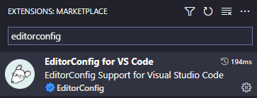
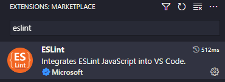
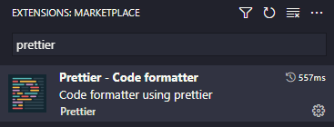

# Get Started a NodeJS Project

Get Started a NodeJS Project with Yarn, Typescript, EditorConfig, Eslint and Prettier


<br/>


## Install Packages with Yarn

```bash
# Generate package.json
yarn init -y

# Install typescript
yarn add -D typescript

# Install ts-node-dev to run typescript project in development enviroment
yarn add -D ts-node-dev

# Install EsLint and typescript plugins
yarn add -D eslint @typescript-eslint/parser @typescript-eslint/eslint-plugin

# Install Prettier and eslint plugin
yarn add -D prettier eslint-config-prettier
```

<br />


## Configure Typescript

```bash
# Create tsconfig.json file...
yarn tsc --init
```

_tsconfig.json_

```json
{
  "compilerOptions": {
    "target": "ES2022",
    "module": "commonjs",
    "rootDir": "./src",
    "outDir": "./build",
    "esModuleInterop": true,
    "forceConsistentCasingInFileNames": true,
    "strict": true,
    "noImplicitAny": true,
    "skipLibCheck": true
  }
}
```

Create scripts in _package.json_ file...

```json
{
  "scripts": {
    "dev": "ts-node-dev --transpile-only --ignore-watch node_modules src/index.ts",
    "build": "tsc",
    "start": "node build/index.js"
  }
}
```

<br />


## Configure EditorConfig

Install EditorConfig VSCode extension and create _.editorconfig_ file in root project directory



_.editorconfig_

```bash
root = true

[*]
end_of_line = crlf # Or lf to linux
indent_style = space
indent_size = 2
charset = utf-8
trim_trailing_whitespace = true
insert_final_newline = true
```

<br />


## Configure EsLint

Install EsLint VSCode extension...



```bash
# Create .eslintrc.json file
yarn create @eslint/config
```

\_.eslintrc.json

```json
{
  "env": {
    "es2021": true,
    "node": true
  },
  "overrides": [],
  "parser": "@typescript-eslint/parser",
  "parserOptions": {
    "ecmaVersion": "latest",
    "sourceType": "module"
  },
  "plugins": ["@typescript-eslint"],
  "extends": ["eslint:recommended", "plugin:@typescript-eslint/recommended"],
  "rules": {
    "@typescript-eslint/no-unused-vars": "error",
    "@typescript-eslint/consistent-type-definitions": ["error", "type"]
  }
}
```

Create _.eslintignore_ on root project directory

```bash
node_modules
build

.gitignore
.editorconfig
.prettierignore
```

<br />


## Configure Prettier

Install Prettier VSCode extension...



Create _.prettierrc_ file in root project directory...

```json
{
  "semi": true,
  "singleQuote": true,
  "arrowParens": "avoid"
}
```

Create _.prettierignore_ file in root project directory...

```bash
node_modules
build

.gitignore
.editorconfig
.eslintignore
```

Use CTRL+SHIFT+P and open JSON VSCode Settings and set the format configuration on save...

```json
{
  "editor.defaultFormatter": "esbenp.prettier-vscode",
  "editor.formatOnSave": true
}
```

Add EsLint Prettier plugin to _.eslintrc.json_ file...

```json
{
  "extends": ["prettier"]
}
```
